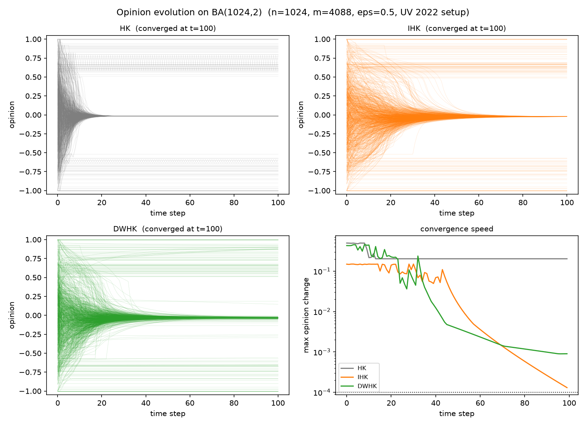

# silence-spiral-hk

Opinion dynamics with a spiral-of-silence mechanism: the perceived opinion
climate dynamically re-weights influence in a Hegselmann–Krause
bounded-confidence model, letting minority voices fade — and a sandbox for
testing whether LLM agents reproduce the effect in networked deliberation
(forthcoming).



## What's inside

- **Classical baselines**: DeGroot-style Hegselmann–Krause (HK) and Inertial
  HK (IHK, Chazelle & Wang 2017) on arbitrary graphs
- **`dwhk`**: the dynamical-weight HK model from
  [Ruan, IEEE UV 2022](https://doi.org/10.1109/UV56588.2022.10185469):
  - opinions update by pairwise convex blends over confidence neighbors,
    `O_i' = mean_j [(1 - w_ij) O_i + w_ij O_j]`
  - weights evolve by `W <- clip(W + delta, 0, 1)` with
    `delta_ij = (2 k_j - d_j) / (n (k_i + 1)) * w_ij` — a speaker's local
    majority share `k_j` vs degree `d_j` amplifies its influence, while
    local-minority speakers lose weight: **the spiral of silence implemented
    in weight space, with no extra free parameters**
- **`gamma` extension**: a climate-feedback gain (gamma = 1 recovers the
  paper) to probe how strongly the mechanism shapes polarization
- **experiments/**: canonical epsilon-scan phase diagram, replication of the
  UV 2022 experiments (BA / WS / ego-Facebook), gamma sweep

## Quick start

```bash
python -m venv .venv
pip install -e .            # or: pip install numpy networkx matplotlib
python experiments/exp1_epsilon_scan.py
python experiments/exp2_paper_replication.py --ego-facebook data/facebook_combined.txt.gz
python experiments/exp3_gamma_extension.py
pytest
```

The ego-Facebook dataset is not committed; download it from
<https://snap.stanford.edu/data/facebook_combined.txt.gz> into `data/`.

## Model definition

Per time step (opinions first, then weights, as in the paper):

1. Confidence neighbors: `N_i = { j ~ i : |O_i - O_j| <= eps }`
2. Opinion update (Eq. 2):
   `O_i' = (1/|N_i|) sum_{j in N_i} [(1 - w_ij) O_i + w_ij O_j]`
3. Weight update (Eq. 6):
   `delta_ij = (2 k_j - d_j) / (n (k_i + 1)) * w_ij`, then clip to [0, 1]

Note: the camera-ready pseudocode box of the UV 2022 paper contains a typo
("S = 1 - W"); Eq. 6 is authoritative and is what this implementation
follows. See `docs/complexity.md` for details.

## Key results

- **exp1**: HK on the complete graph recovers the canonical cluster-vs-eps
  phase diagram with consensus threshold eps_c ≈ 0.228.
- **exp2**: replicates the UV 2022 finding — DWHK converges to dominant
  opinions on BA, WS, and ego-Facebook, and converges faster than the
  frozen-weight variant (`gamma = 0`).  A note on the baseline: `hk_step` is
  **unweighted**, and on every network we tested the unweighted HK baseline is
  itself the most oscillation-prone model here (see exp4).  We do not claim
  that "weighted HK fails while DWHK succeeds"; the causal direction is the
  other way round.
- **exp3**: the gamma sweep shows how the climate feedback trades opinion
  diversity for dominance (RQ1 of the PhD agenda).
- **exp4**: long-horizon convergence audit.  The unweighted HK baseline
  oscillates with a *pinned* step change — 21/24 and 24/24 configurations on BA
  and WS (median log-log slope +0.000), and permanently on ego-Facebook, where
  its per-step change stays pinned at 2.0e-1 for 10 000 steps.  DWHK oscillates
  1/24 and 0/24 on those networks and converges on ego-Facebook (per-step change
  7.5e-4 at t=100 → 1.4e-7 at t=10 000).  Convergence is **not** universal,
  however: on complete bipartite graphs with saturated weights DWHK shows exact
  period-2 oscillation for 7–17 of 20 random initial conditions, so cycling
  depends on the initial condition, not on the graph alone.
  A caution on the metric: judging either by `max(delta)` inside a trailing
  window or by a strict tolerance misclassifies one regime as the other.  exp4
  fits the log-log slope of the step-change envelope instead — flat means
  oscillation, negative means convergence however slow.
- **exp5**: the spiral of silence with the *expression* channel made explicit
  (`sos_step`: private opinion `O_i` plus willingness to speak out `s_i`).
  What is said out loud converges faster than what people privately think —
  the signature the original DWHK cannot represent, and the one the
  willingness-to-speak-out literature actually measures.

## Structural facts (see docs/theory_notes.md)

- Every update is a convex combination ⇒ opinions stay in the initial
  convex hull (proved, tested).
- The opinion update is a time-varying row-stochastic map
  `O(t+1) = P(t) O(t)` — a DeGroot system with climate-dependent weights.

## Reproducibility

Random seeds are fixed in every experiment; figures are generated by the
committed scripts. Complexity analysis: `docs/complexity.md`.

## Citation

```bibtex
@inproceedings{ruan2022dwhk,
  title     = {A Novel Dynamical Weight Hegselmann-Krause Model based on
               Spiral of Silence},
  author    = {Ruan, Jiawei},
  booktitle = {2022 6th International Conference on Universal Village (UV)},
  pages     = {1--6},
  year      = {2022},
  doi       = {10.1109/UV56588.2022.10185469}
}
```

## License

MIT
